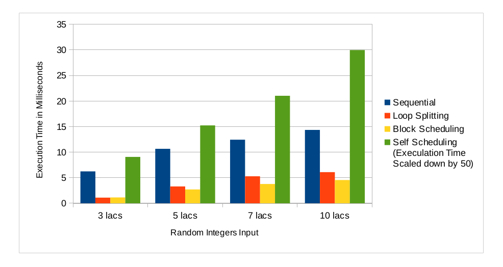
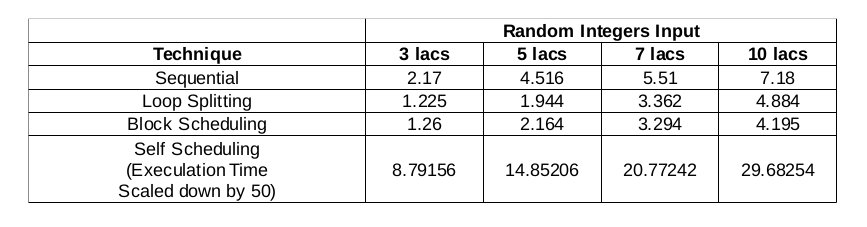

###### :rocket: my first parallel application :rocket:
## Standard Deviation Parallel
### Parallel Implementation for calculating Standard Deviation using Different Parallel Techniques.

* Technologies: C, Shared Memory, Locks, Pthreads
* Tools and OS: GCC, Atom, Ubuntu
* Platform: Command-line
* Techniques: Loop-Splitting, Block-Scheduling, Self-Scheduling
* Lines of Code: 338
* Duration: 1 Week (OCT 2016)

### Comparison of All Techniques

